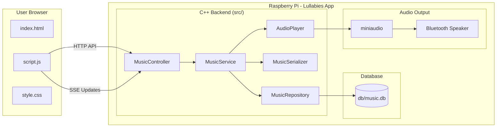
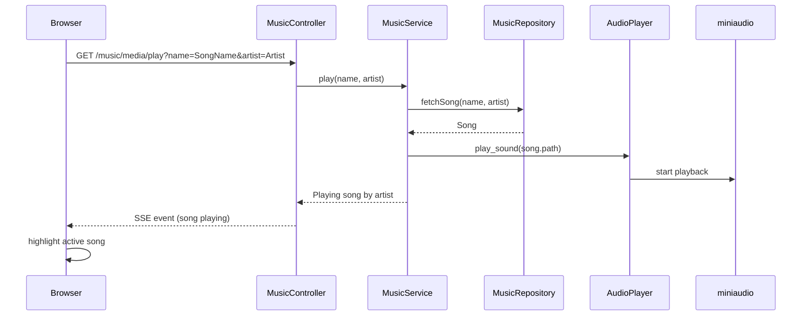

# Lullabies

Lullabies is a small Raspberry Pi application that plays lullabies to help my daughter fall asleep.
It streams music to a Bluetooth speaker and provides a simple local web interface to control playback.

The system automatically plays the next song when the current one finishes, making it ideal for bedtime playlists.

---

# Web Interface


The interface allows you to:

* Browse the lullaby library
* Play or pause songs
* See the currently playing track
* Automatically highlight the active song
* Control playback from any device on the local network

The UI updates in real time using **Server-Sent Events (SSE)**.

---

# Architecture

Lullabies runs on a **Raspberry Pi** and exposes a small web interface for controlling music playback.
The backend is written in **C++** and serves both the frontend and the playback API.



---

# Playback Flow



---

# Repository Structure

```
lullabies/
│
├── src/                        # C++ backend source code
│   │
│   ├── Lullabies.cpp           # Application entry point. Starts the HTTP server
│   │                           # and wires together the service components.
│   │
│   ├── AudioPlayer.h/.cpp      # Wrapper around miniaudio responsible for
│   │                           # playing, pausing, and managing audio playback.
│   │
│   ├── MusicController.h/.cpp  # HTTP layer. Defines API endpoints used by
│   │                           # the web frontend (play, pause, list songs).
│   │
│   ├── MusicService.h/.cpp     # Core application logic. Coordinates playback,
│   │                           # retrieves songs, and manages current state.
│   │
│   ├── MusicRepository.h/.cpp  # Data access layer. Handles reading song
│   │                           # information from the SQLite database.
│   │
│   ├── MusicSerializer.h/.cpp  # Converts C++ objects into JSON responses
│   │                           # returned to the frontend.
│   │
│   ├── Song.h                  # Data model representing a song
│   │
│   ├── SongStatus.h            # Represents playback state
│   │                           # (playing, paused, current track, etc).
│   │
│   └── third_party/            # Embedded third-party libraries
│       ├── httplib.h           # HTTP server library
│       ├── json.hpp            # JSON serialization library
│       ├── miniaudio.h
│       ├── miniaudio.c         # Audio playback library
│       └── sqlite3.h           # SQLite database interface
│
├── static/                     # Frontend served by the backend HTTP server
│   ├── index.html              # Main UI page
│   ├── script.js               # Frontend logic (API calls + SSE updates)
│   └── style.css               # UI styling
│
├── db/
│   └── music.db                # SQLite database storing the song library
│
├── scripts/                    # Helper scripts for development and deployment
│   ├── build_release.sh        # Builds the project using CMake
│   ├── restart.sh              # Restarts the running application
│   └── build_and_run_release.sh# Convenience script to rebuild and restart
│
├── music.service               # systemd service configuration to run the
│                               # application automatically on boot
│
├── CMakeLists.txt              # Build configuration
│
└── README.md                   # Project documentation
```

---

# Technologies

Backend

* **C++23**
* **CMake**
* **SQLite**
* **Server-Sent Events (SSE)**

Libraries

* https://github.com/yhirose/cpp-httplib – HTTP server
* https://github.com/nlohmann/json – JSON serialization
* https://github.com/mackron/miniaudio – audio playback

Frontend

* HTML
* JavaScript
* CSS

---

# Building

Build the project using:

```bash
./scripts/build_release.sh
```

---

# Running

Restart the application:

```bash
./scripts/restart.sh
```

Build and restart in one step:

```bash
./scripts/build_and_run_release.sh
```

---

# Running as a Service

The repository includes a **systemd service configuration**.

```
music.service
```

This allows the application to start automatically when the Raspberry Pi boots.

---

# Adding Songs

Songs are currently added manually to the database.

Open the SQLite database:

```bash
sqlite3 db/music.db
```

Insert a new song:

```sql
INSERT INTO songs VALUES ('SongName', 'Artist', '/path/to/song.mp3');
```

---

# Purpose

This project was built as a simple and reliable way to play lullabies for my daughter at bedtime.

Running everything locally on a **Raspberry Pi** keeps the system simple, reliable, and independent of external services.

---

# Future Improvements

Potential improvements include:

* Web interface for adding songs
* Playlists
* Auto-pause after a certain period of inactivity
* Volume control
