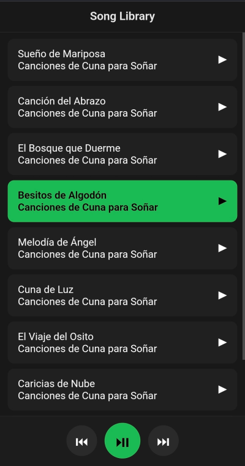
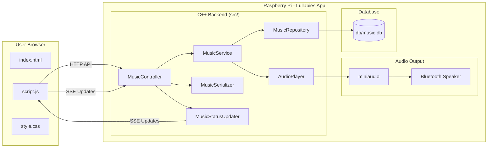
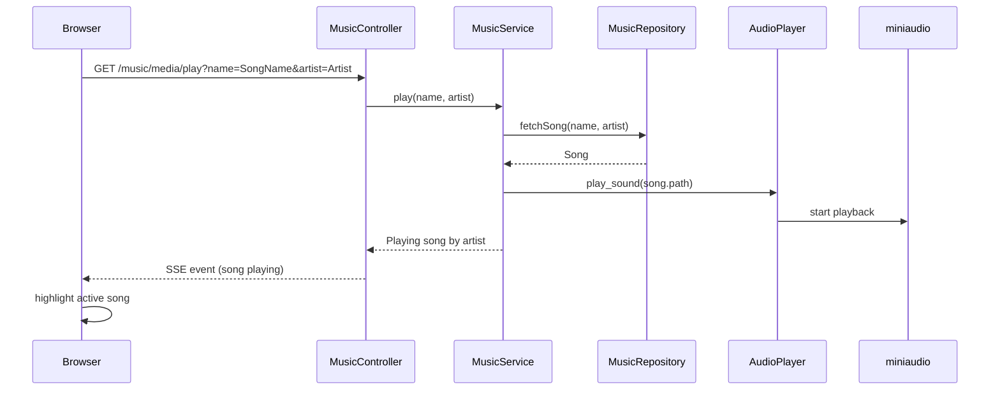
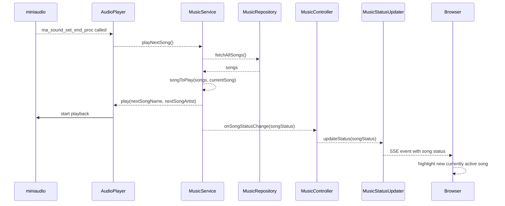

# Lullabies

Lullabies is a small application that plays lullabies to help my daughter fall asleep.
It runs on a Raspberry Pi and streams music to a Bluetooth speaker that stays next to her bed. The app provides a web UI to choose a song, see what's playing, and play / pause.

When one song finishes it automatically plays the next, looping around to the start once it's done.

---

# Web Interface



The UI allows you to:

* View the available songs
* See the currently playing track
* Play or pause songs
* Control playback from any device on the local network

The UI updates in real time using **Server-Sent Events (SSE)** when a song changes.

---

# Architecture

Lullabies runs on a **Raspberry Pi** and exposes a web UI to control music playback.
The backend is written in **C++** and serves both the frontend and the playback API.



---

# Playback Flow



---

# Auto-Play Next Song Flow



---

# Repository Structure

```
lullabies/
│
├── src/                        # C++ backend source code
│   │
│   ├── Lullabies.cpp           # Application entry point. Starts the HTTP server
│   │                           # and wires together the service components.
│   │
│   ├── AudioPlayer.h/.cpp      # Wrapper around miniaudio responsible for
│   │                           # playing, pausing, and managing audio playback.
│   │
│   ├── MusicController.h/.cpp  # HTTP layer. Defines API endpoints used by
│   │                           # the web frontend (play, pause, list songs).
│   │
│   ├── MusicService.h/.cpp     # Core application logic. Coordinates playback,
│   │                           # retrieves songs, and manages current state.
│   │
│   ├── MusicRepository.h/.cpp  # Data access layer. Handles reading song
│   │                           # information from the SQLite database.
│   │
│   ├── MusicStatusUpdater.h	# Used with SSE. Waits for status updates
│   │                           # and publishes them to all active clients
│   │
│   ├── MusicSerializer.h/.cpp  # Converts C++ objects into JSON responses
│   │                           # returned to the frontend.
│   │
│   ├── Song.h                  # Data model representing a song
│   │
│   ├── SongStatus.h            # Represents playback state
│   │                           # (playing, paused, current track, etc).
│   │
│   └── third_party/            # Embedded third-party libraries
│       ├── httplib.h           # HTTP server library
│       ├── json.hpp            # JSON serialization library
│       ├── miniaudio.h
│       ├── miniaudio.c         # Audio playback library
│       └── sqlite3.h           # SQLite database interface
│
├── static/                     # Frontend served by the backend HTTP server
│   ├── index.html              # Main UI page
│   ├── script.js               # Frontend logic (API calls + SSE updates)
│   └── style.css               # UI styling
│
├── tests/                      # Unit tests and mock implementations using GTEST
│   ├── CMakeLists.txt			# Build instructions for tests
│   ├── *.cpp / *.h				# Test cases and mock implementations of miniaudio and music repository
│
├── db/
│   └── music.db                # SQLite database storing the song library
│
├── scripts/                    # Helper scripts for development and deployment
│   ├── build_release.sh        # Builds the project using CMake
│   ├── restart.sh              # Restarts the running application
│   └── build_and_run_release.sh# Convenience script to rebuild and restart
│
├── music.service               # systemd service configuration to run the
│                               # application automatically on boot
│
├── CMakeLists.txt              # Build configuration
│
└── README.md                   # Project documentation
```

---

# Technologies

Backend

* **C++23**
* **CMake**
* **SQLite**
* **Server-Sent Events (SSE)**

Libraries

* https://github.com/yhirose/cpp-httplib – HTTP server
* https://github.com/nlohmann/json – JSON serialization
* https://github.com/mackron/miniaudio – audio playback

Frontend

* HTML
* JavaScript
* CSS

Tests

* GTEST

---

# Building

This project uses GitHub Actions to build and run tests for PRs.  
To build and run the tests locally:

```bash
./scripts/build_release.sh
```

---

# Running

Restart the application:

```bash
./scripts/restart.sh
```

Build, test and restart in one step:

```bash
./scripts/build_and_run_release.sh
```

---

# Running as a Service

The repository includes a **systemd service configuration**.

```
music.service
```

This allows the application to start automatically when the Raspberry Pi boots.

---

# Adding Songs

Songs are currently added manually to the database. They don't normally change.

Open the SQLite database:

```bash
sqlite3 db/music.db
```

Insert a new song:

```sql
INSERT INTO songs VALUES ('SongName', 'Artist', '/path/to/song.mp3');
```

---

# Purpose

This project was built to play lullabies for my daughter at bedtime. 
The music plays off of a Raspberry Pi and bluetooth speaker, so that we can leave the room and continue to play the lullabies.
It also allows us to listen to our own thing with our headphones while putting her to bed.


---

# Future Improvements

The project is largely feature complete for this purpose, however potential improvements include:

* Auto-pause after a certain period of inactivity
* Improve test coverage
* Add static analysis, address sanitizer, linter, and turn on more compile-time warnings and errors
* Web interface for adding songs
* Playlists
* Volume control
